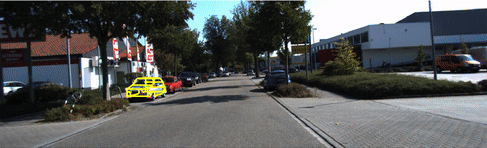
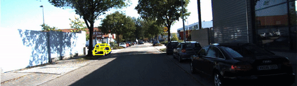
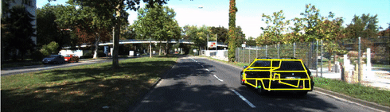

# Shape priors for monocular object localization
Implementation of IROS 2017 research paper: [Shape priors for real-time monocular object localization in dynamic environments](https://ieeexplore.ieee.org/abstract/document/8205990/) 










## Instructions
**input.txt** file contains initialization values that you can copy and paste in the matlab command line. <br/>
To view the reprojection of a car of a particular sequence, frame and id change the input.txt parameters.

### Running the code

After initializing values you can run the script by the following command in matlab. **Make sure you change your directory location for KITTI dataset in the code**
```
# frame is the wireframe of the car
# seq - sequence
# frm - image frame
# camH - camera height
# avgCarWidth - average car width
# avgCarHeight - average car height
# avgCarLength - average car avgCarLength
# K - camera intrinsic matrix
complete_pipeline;
```


